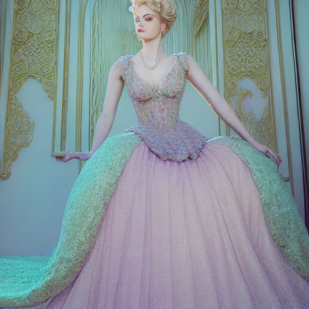

# Multi-Modal Fine-Tuning: Rococo Art with Stable Diffusion & Music Generation

This repository contains two complementary projects that explore generative AI in the domains of **visual art** and **music**. Each notebook demonstrates fine-tuning or adaptation of state-of-the-art models for creative content generation:

- **`StableDiffusionFineTuning.ipynb`** – Fine-tunes Stable Diffusion on Rococo artwork to generate fantasy art in a Rococo style.
- **`MusicABCGenerator.ipynb`** – Uses the Mistral-7B language model to label ABC notation music with mood/sound/rhythm tags, and prepares data to train a text-to-ABC music generator.

---

## Contents

### 1. `StableDiffusionFineTuning.ipynb`

This notebook fine-tunes the **Stable Diffusion v1-4** model on a custom dataset of Rococo-style artwork. It uses image-text pairs, where the genre of each image is used as a text prompt. Key steps include:

- Loading and transforming Rococo images and metadata
- Fine-tuning the UNet and CLIP text encoder on paired image-text data
- Sampling noise, encoding with the VAE, and training with MSE loss
- Saving and exporting the trained model
- Generating fantasy-themed Rococo images from detailed prompts

> **Dataset Used**: [Custom Rococo art dataset `Rococo.csv` + images folder](https://www.kaggle.com/datasets/venikhl/rococo/data)

### 2. `MusicABCGenerator.ipynb`

This notebook uses the **Mistral-7B-Instruct** model to describe melodies in ABC notation with high-level musical tags (mood, sound type, rhythm). Then it prepares a dataset for fine-tuning a text-to-ABC generator.

Key features:

- Loads 1,000 ABC melodies from the dataset
- Uses LLM prompting to label each melody with mood, sound type, and rhythm
- Stores results in a labeled JSON file (`full_labeled_abc.json`)
- Converts labeled samples into a dataset for sequence-to-sequence training
- Prepares inputs for fine-tuning a **T5-small** model to generate ABC notation music from textual descriptions

> **Model Used**: `mistralai/Mistral-7B-Instruct-v0.1` (for labeling), `t5-small` (for sequence generation)

---

## Getting Started

### Requirements

- Python ≥ 3.8
- Kaggle environment or local GPU
- Libraries:
  - `transformers`
  - `diffusers`
  - `torch`
  - `datasets`
  - `Pillow`
  - `matplotlib`
  - `tqdm`

### How to Run

1. Upload both notebooks to [Kaggle Notebooks](https://www.kaggle.com/code).
2. For `StableDiffusionFineTuning.ipynb`, make sure the image dataset and CSV are uploaded and paths are correctly set.
3. For `MusicABCGenerator.ipynb`, add your [Hugging Face token](https://huggingface.co/settings/tokens) as a Kaggle secret under `"HF_token"`.
4. Run each notebook cell-by-cell to follow the generation process.

---

## Example Output

### Generated Image

> *From fine-tuned Stable Diffusion on Rococo prompt*

### Music Prompt Sample

[Click here to listen](generated_music.mid)
